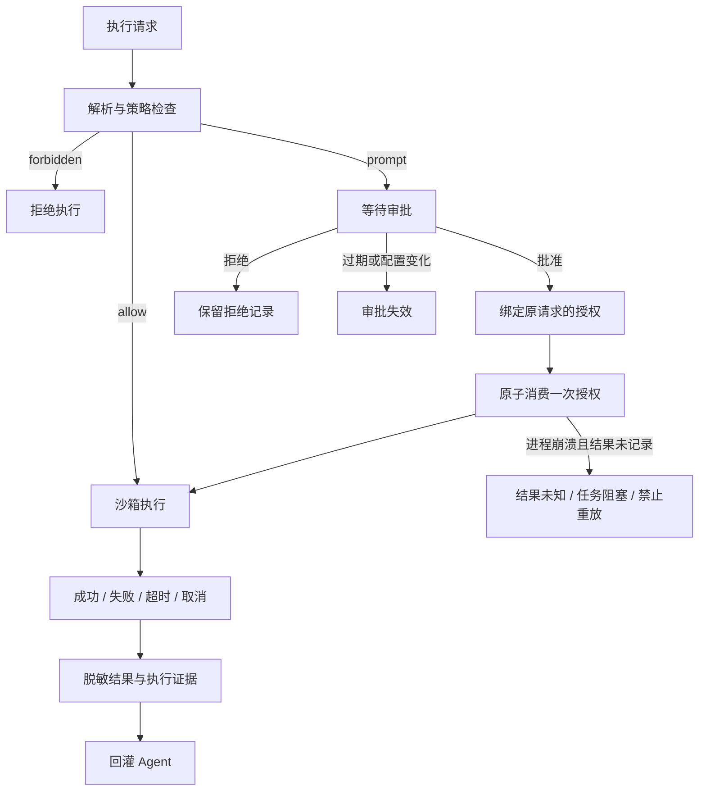

# 执行生命周期验证报告

验证日期：2026-09-28。对象：`shell_exec` 通用执行器及与本报告同批提交的实现。

结论：单实例的本地执行、单次审批、失败证据和会话恢复闭环已验证。Docker 通用执行器新增持久化执行身份、崩溃回收及完整容器进程终止，已通过本地 SIGKILL 故障注入；系统沙箱尚无相同保证。参考方案中的生产执行生命周期仍未全部完成，主要缺少资源范围校验、临时凭据签发、网络白名单和多实例协调。基础验证使用本地模拟与隔离环境；真实 CLS 只读集成验收见后文。本次未执行真实集群或云写操作。

## 并行验证分工

| 验证任务 | 范围 | 结果 |
| --- | --- | --- |
| 审批与权限 | 完整请求绑定、过期、拒绝、并发、防重放、配置撤销、凭据轮换 | 独立复验通过 |
| 会话与证据 | 批准后继续、子 Agent、任务归属、失败、停止、重启、前端刷新 | 独立复验通过 |
| 进程与沙箱 | 超时、后代进程、输出、Docker、凭据目录清理 | 常规路径通过；Docker 崩溃回收补验通过，系统沙箱边界保留 |
| 主线程交叉验证 | 对照方案的 12 个步骤、修复、完整回归 | 测试通过，保留未完成项 |

沙箱组完成了独立缺陷复现；最终清理改动由主线程复验。

## 对照方案的 12 个步骤

| 步骤 | 状态 | 实现与验收边界 |
| --- | --- | --- |
| 1. Agent 生成 ExecRequest | 已验证 | 命令、用途、配置、收紧超时；Agent 身份由服务端绑定 |
| 2. 解析命令分段 | 已验证 | 字面 argv；拒绝展开、替换、重定向和后台语法；复合命令重新构造 |
| 3. 每段 ExecPolicy | 已验证 | 前缀规则；所有段先检查；内置禁止规则不能被 allow 或审批覆盖 |
| 4. ScopePolicy 校验用户/环境/资源 | 部分实现 | 已有 Agent → profile 分配；没有独立 SSO、环境、集群、namespace 或资源范围校验 |
| 5. 取最严格决策 | 已验证 | forbidden > prompt > allow；多段与多规则回归通过 |
| 6. allow / prompt / forbidden 分流 | 已验证 | 自动执行、持久化单次审批、直接拒绝；只支持当前控制台管理员审批，未实现双人审批 |
| 7. 最小权限短期凭据 | 部分实现 | 服务端环境来源、读写凭据分离、私有 kubeconfig；未实现 Broker/STS 签发、到期续签及云端撤销 |
| 8. 创建隔离环境 | 部分验证 | 严格 OS/Docker、不降级、私有目录；macOS 实测，Docker 使用已有 Python 镜像；Linux Landlock 未做真实环境验证 |
| 9. 执行与采集 | 已验证常规路径与 Docker 恢复 | stdout/stderr、退出码、超时、取消；Docker 完整容器回收覆盖脱离进程组与服务 SIGKILL；OS 不保证任意后代终止 |
| 10. 脱敏与输出限制 | 已验证 | 注入值/常见凭据字段脱敏、采集时限流；超过采集上限的原始字节不保留 |
| 11. Evidence / Audit 持久化 | 已验证常规路径与 Docker 执行身份 | 成功和结构化失败均保留结果、证据、审计；取消后独立落库；Docker 在创建前记录资源身份，审批消费与执行身份原子提交；崩溃时输出可能丢失，恢复记 unknown；非不可篡改审计库 |
| 12. Observation 回灌下一轮推理 | 已验证 | 批准/拒绝后继续原会话、原任务和原 Agent；失败带明确 error 与证据；重启结果未知时不重放写操作 |

## 执行状态

审批保证本地授权最多消费一次，不保证外部变更“恰好一次”。命令失败、超时、取消或崩溃时，外部资源可能已改变；必须先核查目标资源。配置热更新在授权批准和消费阶段读取最新配置，并与引擎切换互斥；已启动的操作不能靠配置撤销自动回滚。

## 本次发现并修复的问题

| 问题 | 修复 | 回归证据 |
| --- | --- | --- |
| kubectl 前置参数绕过 Secret/config 禁令；tccli 参数位移绕过 Delete/Terminate 禁令 | 禁止条件检查全部 token；有歧义的 token 也按禁止处理 | `policy_test.go`、`lifecycle_test.go`；7 项独立位移复现全部 forbidden |
| 已开始的审批请求沿用旧配置，热更新撤销无效 | 最新配置保护批准/消费的数据库原子检查 | `approval_revocation_test.go`；相同复现从执行成功变为 HTTP 409、无执行 |
| 非零退出与超时被记为工具成功 | Observation 明确失败；审计 OK=false | `runtime_test.go`、实际退出/超时独立测试 |
| 结构化失败在证据落库前丢失 | 失败也保留 payload/evidence；向 Agent 返回明确 error | `gateway_test.go`；启动失败、取消结果可取回 |
| 服务重启后未结工具调用显示 completed | 最后一次未结调用且无活动执行时显示 blocked | `server/lifecycle_test.go` |
| consumed 尚无 outcome 时详情页停止刷新 | 有时限地继续轮询到最终结果 | `approvals.test.js` |
| 停止执行后任务显示 failed | 取消上下文明确映射 cancelled；取消结果落库 | `TestHandlerStopRecordsCancelled`，验证结果与审计均持久化 |
| 正常退出的主进程留下后台同组子进程 | 每个返回路径终止该进程组 | `sandbox/lifecycle_unix_test.go`；独立真实进程复验 |
| 输出管道超时误报“未启动” | Started 与 Truncated 标志，区分启动和收尾失败 | `sandbox/lifecycle_unix_test.go`、`execution/cleanup_test.go` |
| 子进程改变目录权限导致 kubeconfig 残留 | 预先持有私有目录 Root，受控恢复目录权限后清理；失败明确报告 | `workspace_test.go`、`cleanup_test.go`；不跟随目录外符号链接 |
| Docker 凭据出现在 CLI 参数中 | 严格执行只传环境变量名称，值通过 CLI 环境注入；禁止 profile 改写 DOCKER_* | `strict_test.go`；实际 Docker 注入测试通过 |

## 仍未完成的验收任务

| 优先级 | 任务 | 完成标准 |
| --- | --- | --- |
| P0（系统沙箱） | OS 崩溃回收与任意后代进程终止 | Docker 已有可验证的执行边界；需要同等保证必须选择 Docker。OS 后续需要独立进程监护/cgroup 等真实环境验证，不能以杀进程组宣称覆盖任意后代 |
| P1 | ScopePolicy / SSO | 用户、环境、集群、namespace、资源范围和审批目标一致；变更参数无法扩大目标范围 |
| P1 | Credential Broker / STS | 执行前签发最小权限短期身份；TTL、撤销、读写切换可验证；长期凭据不交给执行环境 |
| P1 | 网络出口白名单 | 强制域名/IP/端口约束及 DNS/代理绕过测试；当前 network=true 只表示联网，没有目标限制 |
| P1 | 多实例租约与持久化终态 | 跨实例会话互斥、执行租约/心跳、终态与停止状态持久化；一个实例不能把另一个实例的执行误判为失联 |
| P2 | 结构化变更与回滚 | rollout/scale 等明确对象、预计影响、变更前后检查、回滚约束；高风险操作双人审批 |
| 集成验收 | 真实只读/受控写环境 | 使用预生产限定身份验证云端 IAM/RBAC、失败前后实际资源状态、Linux 沙箱和诊断镜像；当前本地测试不能替代 |

已实测的 OS 未完成边界：严格 macOS OS 沙箱内 `setsid` 子进程可以在超时后存活。此前 Docker CLI 被强杀后容器仍运行的问题，已通过下节的持久化回收解决；主服务停机期间需要独立启动回收器，不会靠进程组清理自动生效。

## 验证记录

- 完整后端：`GOCACHE=/tmp/jelly-agent-go-cache go test ./...` 通过。
- 前端：`npm test -- --run`，12 个文件、178 项测试通过。
- 静态检查：`go vet ./...` 通过。
- 并发批准与消费：独立 `-race` 连跑 3 次通过；本次批准/消费、热更新撤销、真实停止和失败证据的 `-race` 回归通过。
- 沙箱独立复验：正常返回、普通后代超时、取消、输出管道收尾失败、私有凭据目录清理通过；Docker 正常/超时/取消回收及环境注入通过。镜像为本机已有 `python:3.12-slim-bookworm`，禁网、禁止拉取。
- 前端生产构建：`npm run build` 通过；`git diff --check` 通过。Linux、PostgreSQL 真实服务和生产云变更未实测。

审批实现的授权范围为 `shell_exec`，不能据此认为所有 MCP 工具或技能脚本的写操作已统一接入审批。

## 自主查询接入补验

此前 TencentQuery 未获执行配置，保存的 Agent 变量未接入通用执行器，用户级 Python CLI 也不能在隔离 HOME 中加载。此次补充分配后的必需工具保留、Agent 变量名称映射、独立 CLI 运行目录、帮助/错误修正/分页提示，并更新领域职责。

受控模型回归验证了转交 → 帮助 → 参数错误 → 修正查询 → 结果证据，在工具预算 1 下仍能完成。独立复核验证了变量快照与审批撤销、审批专用变量不进入技能脚本、跨配置不得借用写来源、运行目录链接不得扩大读取范围。

实际配置环境中，仅输入“我有哪些 CLS？”即触发协调者转交、CLI 帮助、DescribeLogsets/DescribeTopics 查询，以及发现首页数量不足后的补查。已按 API TotalCount 核对返回数量与未截断状态；模型最终给出结果与证据引用。账户资源明细及执行日志仅保存在忽略的私有体验目录，不随源码提交。

后端完整回归、静态检查、execution/engine/server 并发回归及前端构建通过。真实元数据只读查询不替代上表中的预生产受控写、IAM/RBAC、Linux 或崩溃回收验收。接入方法见 [自主查询配置](autonomous-query-setup.md)。

## Docker 崩溃回收补验

### 执行与恢复约束

- `execution_runs` 记录 ExecID、会话/Agent/profile、审批 ID、私有目录范围、随机 owner、Docker 服务身份、完整容器 ID、状态、截止时间及回收租约。它不存凭据、环境变量或命令输出，也不随会话删除级联消失。
- 创建前持久化 intent；Docker 写审批的消费与 intent/exec_id 关联在同一数据库事务中提交。容器 ID 落库后才能启动，启动 CAS 必须持有未过期的 prepared 租约。数据库不可用时禁止启动。
- 取消自动删除：先 `create`，再 `start -a -i`，根据容器 StartedAt 和实际 State.ExitCode 确认业务结果，最后显式回收。未启动容器的默认退出码 0 不代表成功。
- 服务启动和每 15 秒检查当前范围；独立入口 `jelly --config <配置文件> execution recover --watch` 可交给进程守护服务。去掉 `--watch` 执行一次。使用同一配置、数据库、本机私有目录和原 Docker 服务，不能把配置指向另一台主机或另一 Docker context 后当作原资源已回收。
- 有效执行不会被启动检查立即杀掉。prepared/start 租约按配置超时加 30 秒收尾余量计算；过期后回收器认领最多 30 秒的清理租约。主服务死亡时，需要等待截止时间和一次轮询；没有独立回收器时，恢复发生在服务重启后。
- 回收核验 scope、owner、随机名称、Docker 服务身份和完整容器 ID。标记不匹配、服务不可达或目录身份异常时保留记录与凭据目录。确认容器已移除后，才删除私有目录；不会猜 PID 或只按容器名称删除。
- 保留终态记录作为恢复凭据，并扫描同范围容器及晚到目录，覆盖第一次查不到资源后，create RPC/目录创建才完成的窗口。未知资源没有原始记录时保留并报告；不要手工清空这些记录或范围标记。
- 失联执行记 `unknown`，审批仍是 consumed，禁止重放。业务结果与 `cleanup_pending` 分开；回收器已经记录的未知终态不能被晚到线程覆盖。崩溃前没完成落库的 stdout/stderr 无法补回，不伪造证据。

### 故障注入结果

| 场景 | 验证结果 |
| --- | --- |
| 审批消费和 intent 插入失败 | 整个事务回滚；审批未消费，没有部分关联 |
| 单次审批启动后强杀执行服务 | 容器仍运行，私有目录保留；过期回收后容器/目录消失，审批 consumed/unknown，再调用同授权被拒绝 |
| 子进程 `setsid` 脱离进程组 | 验证主进程和子进程 session 不同；完整容器删除后容器内进程全部终止 |
| 第一次回收查无容器，之后 create 才完成 | retained intent 核验并绑定完整 ID，后续扫描成功回收，不重启业务 |
| cleaned 记录的目录晚到 | 后续目录扫描再次回收，不永久漏清凭据 |
| 未过期执行 | 保留资源，不误杀 |
| owner 错误、Docker 服务身份变化、目录符号链接 | 拒绝误删；保留相应资源，目录外文件未改变 |
| 正常成功、业务退出 7、执行超时、工作目录权限改为 000 | 真实 Docker 回归通过；容器和凭据目录均清理 |
| Docker start 被拒绝、业务参数含 `--rm` | 独立模拟回归通过；未启动不误报成功，业务参数保持原样 |
| 恢复器 unknown 后晚到 Finish | unknown 保持不变，不被成功/失败覆盖 |

故障测试显式开启 `JELLY_TEST_DOCKER=1`，仅使用已有 `python:3.12-slim-bookworm` 镜像，禁止拉取、禁网、无真实云写操作。测试创建的容器均已清理。独立审查补充了启动拒绝和参数完整性测试，并交叉复核事务关联、终态竞态及删除顺序。

最终完整后端、静态检查、execution/sandbox/engine/server 的 race（包含 Docker 故障测试）、前端 178 项测试及构建通过；独立回收 CLI 在私有体验配置中正常退出。SQLite 自动建表；已有 PostgreSQL 部署需要先应用 `migrations/postgres/0002_execution_runs.sql`，本轮没有实际 PostgreSQL 服务验收。

这些保证只覆盖通过 `shell_exec` 注册的 Docker 通用执行器。当前 tccli 本地体验使用系统沙箱；切换 Docker 时，CLI 要预装在镜像中，宿主机 `tool_dir` 不会被挂载。技能脚本、MCP 工具、生产 IAM/RBAC、网络出口和跨实例任务协调需要各自的后续验收。
