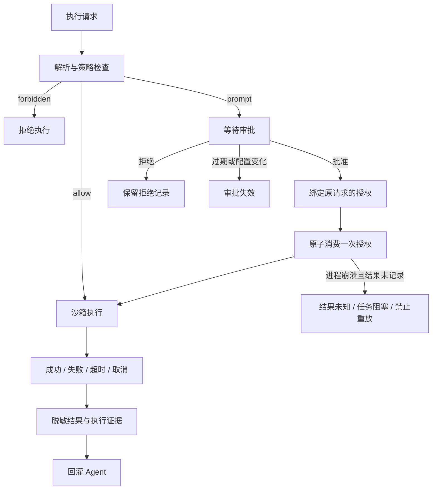

# 执行生命周期验证报告

验证日期：2026-09-28。对象：`shell_exec` 通用执行器及与本报告同批提交的实现。

结论：单实例的本地执行、单次审批、失败证据和会话恢复闭环已验证。参考方案中的生产执行生命周期尚未全部完成，主要缺少资源范围校验、临时凭据签发和崩溃后的资源回收。本次没有连接生产云服务或执行真实集群变更。

## 并行验证分工

| 验证任务 | 范围 | 结果 |
| --- | --- | --- |
| 审批与权限 | 完整请求绑定、过期、拒绝、并发、防重放、配置撤销、凭据轮换 | 独立复验通过 |
| 会话与证据 | 批准后继续、子 Agent、任务归属、失败、停止、重启、前端刷新 | 独立复验通过 |
| 进程与沙箱 | 超时、后代进程、输出、Docker、凭据目录清理 | 常规路径通过；两项崩溃/进程边界仍未完成 |
| 主线程交叉验证 | 对照方案的 12 个步骤、修复、完整回归 | 测试通过，保留未完成项 |

沙箱组完成了独立缺陷复现；最终清理改动由主线程复验。

## 对照方案的 12 个步骤

| 步骤 | 状态 | 实现与验收边界 |
| --- | --- | --- |
| 1. Agent 生成 ExecRequest | 已验证 | 命令、用途、配置、收紧超时；Agent 身份由服务端绑定 |
| 2. 解析命令分段 | 已验证 | 字面 argv；拒绝展开、替换、重定向和后台语法；复合命令重新构造 |
| 3. 每段 ExecPolicy | 已验证 | 前缀规则；所有段先检查；内置禁止规则不能被 allow 或审批覆盖 |
| 4. ScopePolicy 校验用户/环境/资源 | 部分实现 | 已有 Agent → profile 分配；没有独立 SSO、环境、集群、namespace 或资源范围校验 |
| 5. 取最严格决策 | 已验证 | forbidden > prompt > allow；多段与多规则回归通过 |
| 6. allow / prompt / forbidden 分流 | 已验证 | 自动执行、持久化单次审批、直接拒绝；只支持当前控制台管理员审批，未实现双人审批 |
| 7. 最小权限短期凭据 | 部分实现 | 服务端环境来源、读写凭据分离、私有 kubeconfig；未实现 Broker/STS 签发、到期续签及云端撤销 |
| 8. 创建隔离环境 | 部分验证 | 严格 OS/Docker、不降级、私有目录；macOS 实测，Docker 使用已有 Python 镜像；Linux Landlock 未做真实环境验证 |
| 9. 执行与采集 | 已验证常规路径 | stdout/stderr、退出码、超时、取消、后台进程组清理；脱离进程组和服务 SIGKILL 不在完成范围 |
| 10. 脱敏与输出限制 | 已验证 | 注入值/常见凭据字段脱敏、采集时限流；超过采集上限的原始字节不保留 |
| 11. Evidence / Audit 持久化 | 已验证常规路径 | 成功和结构化失败均保留结果、证据、审计；取消后使用有时限的独立落库上下文；非不可篡改审计库 |
| 12. Observation 回灌下一轮推理 | 已验证 | 批准/拒绝后继续原会话、原任务和原 Agent；失败带明确 error 与证据；重启结果未知时不重放写操作 |

## 执行状态

审批保证本地授权最多消费一次，不保证外部变更“恰好一次”。命令失败、超时、取消或崩溃时，外部资源可能已改变；必须先核查目标资源。配置热更新在授权批准和消费阶段读取最新配置，并与引擎切换互斥；已启动的操作不能靠配置撤销自动回滚。

## 本次发现并修复的问题

| 问题 | 修复 | 回归证据 |
| --- | --- | --- |
| kubectl 前置参数绕过 Secret/config 禁令；tccli 参数位移绕过 Delete/Terminate 禁令 | 禁止条件检查全部 token；有歧义的 token 也按禁止处理 | `policy_test.go`、`lifecycle_test.go`；7 项独立位移复现全部 forbidden |
| 已开始的审批请求沿用旧配置，热更新撤销无效 | 最新配置保护批准/消费的数据库原子检查 | `approval_revocation_test.go`；相同复现从执行成功变为 HTTP 409、无执行 |
| 非零退出与超时被记为工具成功 | Observation 明确失败；审计 OK=false | `runtime_test.go`、实际退出/超时独立测试 |
| 结构化失败在证据落库前丢失 | 失败也保留 payload/evidence；向 Agent 返回明确 error | `gateway_test.go`；启动失败、取消结果可取回 |
| 服务重启后未结工具调用显示 completed | 最后一次未结调用且无活动执行时显示 blocked | `server/lifecycle_test.go` |
| consumed 尚无 outcome 时详情页停止刷新 | 有时限地继续轮询到最终结果 | `approvals.test.js` |
| 停止执行后任务显示 failed | 取消上下文明确映射 cancelled；取消结果落库 | `TestHandlerStopRecordsCancelled`，验证结果与审计均持久化 |
| 正常退出的主进程留下后台同组子进程 | 每个返回路径终止该进程组 | `sandbox/lifecycle_unix_test.go`；独立真实进程复验 |
| 输出管道超时误报“未启动” | Started 与 Truncated 标志，区分启动和收尾失败 | `sandbox/lifecycle_unix_test.go`、`execution/cleanup_test.go` |
| 子进程改变目录权限导致 kubeconfig 残留 | 预先持有私有目录 Root，受控恢复目录权限后清理；失败明确报告 | `workspace_test.go`、`cleanup_test.go`；不跟随目录外符号链接 |
| Docker 凭据出现在 CLI 参数中 | 严格执行只传环境变量名称，值通过 CLI 环境注入；禁止 profile 改写 DOCKER_* | `strict_test.go`；实际 Docker 注入测试通过 |

## 仍未完成的验收任务

| 优先级 | 任务 | 完成标准 |
| --- | --- | --- |
| P0 | 崩溃后的资源恢复回收 | 持久化执行/容器/目录身份与生命周期；重启/独立回收器识别遗留资源；SIGKILL 故障注入验证；只回收自身资源，结果未知不重试 |
| P0 | 不可脱离的后代进程生命周期 | OS 子进程 `setsid` 后仍能保证终止，或明确限制为可验证的容器/cgroup 执行边界；不能以杀进程组宣称覆盖任意后代 |
| P1 | ScopePolicy / SSO | 用户、环境、集群、namespace、资源范围和审批目标一致；变更参数无法扩大目标范围 |
| P1 | Credential Broker / STS | 执行前签发最小权限短期身份；TTL、撤销、读写切换可验证；长期凭据不交给执行环境 |
| P1 | 网络出口白名单 | 强制域名/IP/端口约束及 DNS/代理绕过测试；当前 network=true 只表示联网，没有目标限制 |
| P1 | 多实例租约与持久化终态 | 跨实例会话互斥、执行租约/心跳、终态与停止状态持久化；一个实例不能把另一个实例的执行误判为失联 |
| P2 | 结构化变更与回滚 | rollout/scale 等明确对象、预计影响、变更前后检查、回滚约束；高风险操作双人审批 |
| 集成验收 | 真实只读/受控写环境 | 使用预生产限定身份验证云端 IAM/RBAC、失败前后实际资源状态、Linux 沙箱和诊断镜像；当前本地测试不能替代 |

已实测的未完成边界：严格 macOS OS 沙箱内 `setsid` 子进程可以在超时后存活；Docker CLI 被强杀后 `--rm` 容器仍运行。复现测试主动终止并清理自己的子进程和容器。本次没有将这两项标为通过。

## 验证记录

- 完整后端：`GOCACHE=/tmp/jelly-agent-go-cache go test ./...` 通过。
- 前端：`npm test -- --run`，12 个文件、177 项测试通过。
- 静态检查：`go vet ./...` 通过。
- 并发批准与消费：独立 `-race` 连跑 3 次通过；本次批准/消费、热更新撤销、真实停止和失败证据的 `-race` 回归通过。
- 沙箱独立复验：正常返回、普通后代超时、取消、输出管道收尾失败、私有凭据目录清理通过；Docker 正常/超时/取消回收及环境注入通过。镜像为本机已有 `python:3.12-slim-bookworm`，禁网、禁止拉取。
- 前端生产构建：`npm run build` 通过；`git diff --check` 通过。Linux、PostgreSQL 真实服务和生产云变更未实测。

审批实现的授权范围为 `shell_exec`，不能据此认为所有 MCP 工具或技能脚本的写操作已统一接入审批。
