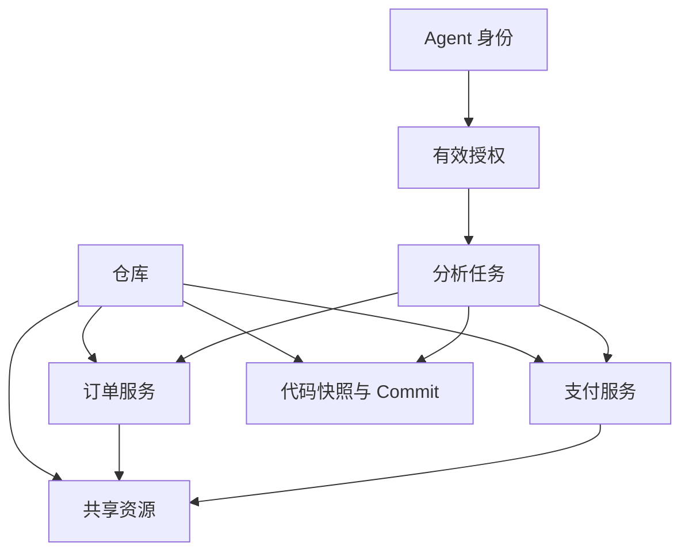
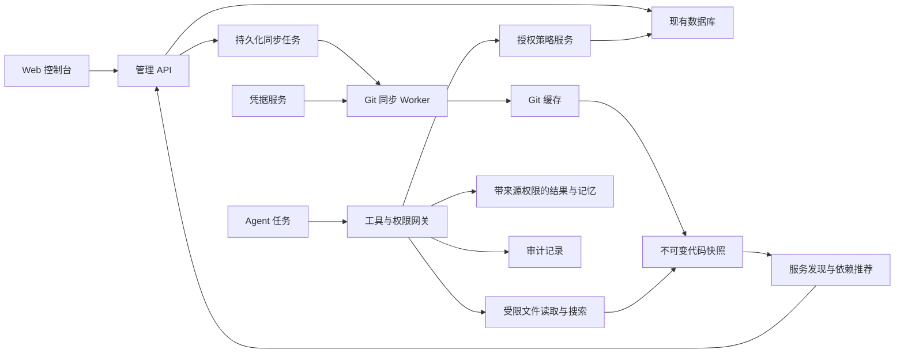
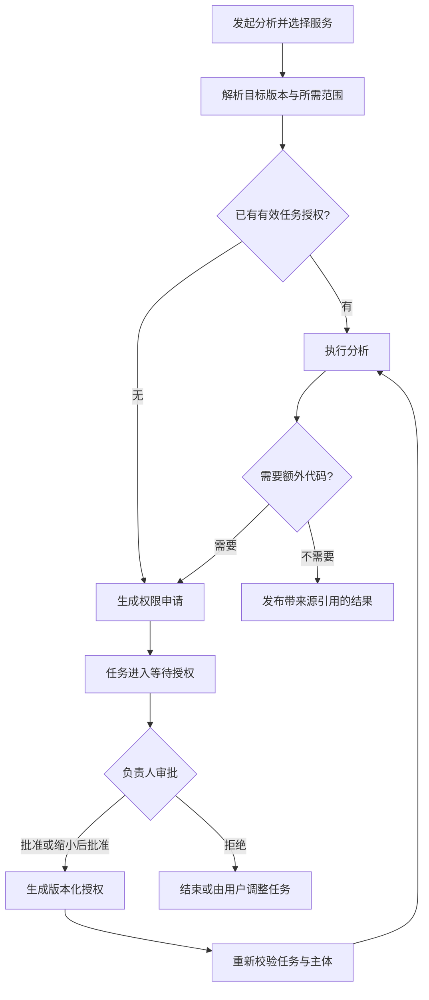

> 历史扩展方案，暂不属于当前开发范围。当前范围以 [创建、同步与 Agent 分配简版方案](monorepo-code-analysis-design.md) 为准。审批、细粒度权限、服务治理等内容仅供后续参考。

# Jelly Agent 微服务大仓库代码接入与按需授权设计报告

**版本：** V1.1（结合 Silkworm 本地仓库修订）  
**日期：** 2026-09-15  
**文档性质：** 产品与技术设计，供方案评审、开发拆分和验收使用  
**适用场景：** 单个 Git 仓库包含多个微服务，多数服务位于 `services/` 下；也兼容多个仓库接入

> 本报告描述目标系统，当前仓库级原型不等于完整方案已实现。已只读检查 `/Users/mingjing/coding/silkworm` 的本地结构与代表服务的导入关系；第 22 章给出实际适配结论，其余订单/支付示例用于解释通用模型。尚未验证远端拉取、线上部署或完整调用链。

**Silkworm 阅读入口：** 实际业务目录为 `services/`，共有 126 个一级候选；还需区分 `common/` 公共库、`gateway/`/`ad/` 接口与封装，以及跨服务非接口依赖。详见第 22 章及[服务候选清单](silkworm-service-inventory.md)。

## 目录

1. 执行摘要与关键决策
2. 背景、目标和范围
3. 资源模型与术语
4. 总体架构与职责
5. Web 页面与用户流程
6. 仓库接入和凭据管理
7. 同步、快照与大仓库优化
8. 服务发现与公共依赖
9. 按需授权模型
10. 权限申请、审批和任务恢复
11. Agent 代码分析流程与工具
12. 多 Agent、分析结果和记忆隔离
13. 数据模型与一致性
14. API 与状态设计
15. 安全边界与异常处理
16. 部署、容量和可观测性
17. 与当前 Jelly Agent 的集成及差距
18. 实施阶段与开发拆分
19. 验收标准和测试矩阵
20. 风险、待确认事项与最终建议
21. 附录：配置及完整案例
22. Silkworm 实际仓库盘点与落地适配

---

## 1. 执行摘要与关键决策

### 1.1 结论

采用“**仓库统一同步、服务独立授权、任务固定版本、每次访问校验权限**”的设计。

一个包含几十个微服务的仓库，只创建一份仓库接入配置。`services/` 下每个被确认的微服务作为一个独立的分析和授权资源，不为每个服务重复克隆整个仓库。

用户面向“订单服务”“支付服务”等业务名称操作；后台将服务授权转换成明确的代码路径、公共依赖、分支、版本和操作范围。

### 1.2 必须确定的架构决策

| 决策 | 方案 | 目的 |
|---|---|---|
| 同步单位 | Git 仓库及受管理分支 | 避免每个服务重复下载 |
| 授权单位 | 服务，必要时细化到路径 | 一个 Agent 不默认获得整库权限 |
| 版本单位 | 仓库 Commit + 不可变快照 | 跨服务分析使用一致版本 |
| 默认权限 | 拒绝；由有效授权显式开放 | 新服务、新 Agent 不自动获得访问权 |
| 默认分析授权 | 当前任务 + 有效期上限 | 同一 Agent 的不同任务不串用权限 |
| 公共依赖 | 人工确认的资源范围；自动分析只做推荐 | 避免 import 自动扩大权限 |
| 同步执行 | 后台持久化任务，独立 Worker | 关闭页面、服务重启后能追踪和恢复 |
| 模型读取 | 通过专用工具和统一权限网关 | 不依靠提示词约束权限 |
| 结果与记忆 | 按来源资源携带访问标签 | 避免绕过文件工具泄露代码 |
| 初期索引 | 目录清单和文本搜索 | 先建立正确的权限与版本边界，再增加语义索引 |

### 1.3 交付路径

先交付可验证的“服务级只读分析”，再加入任务审批和持续同步。不能先开放整个仓库，再把按服务隔离留作以后补充。

---

## 2. 背景、目标和范围

### 2.1 已知需求

- 平台为现有 Jelly Agent，已有 Web 控制台、Agent 定义、工具调用和任务能力。
- 需要通过页面配置不同项目的代码拉取。
- 接入代码用于 Agent 分析，并按需授予权限。
- 存在微服务大仓库，多个服务放在 `services/` 目录下。
- 当前用户需要完整方案报告，本报告不执行新的业务功能开发。

### 2.2 目录示例

```text
company-backend/
├── services/
│   ├── order/
│   ├── payment/
│   └── user/
├── pkg/
│   ├── database/
│   └── auth/
├── common/
│   └── money/
├── api/
│   ├── order/
│   └── payment/
├── go.mod
├── go.sum
└── go.work
```

该结构用于说明方案。真实仓库可能有更深层目录、多个 Go module、其他语言、嵌套服务或独立接口仓库，均应允许显式配置。

### 2.3 建设目标

1. 统一管理仓库、凭据、分支、同步状态和代码版本。
2. 自动发现服务候选，人工确认每个服务的分析边界。
3. 支持按服务、Agent、任务、路径和时间授权。
4. 支持单服务定位和跨服务调用链分析。
5. 为分析结论提供可复核的版本、文件和行号引用。
6. 保证目录、搜索、文件、缓存、结果及记忆遵循一致的资源权限。
7. 对同步、授权、读取、拒绝和结果分享提供审计。

### 2.4 当前范围之外

自动修改代码、提交 PR、推送仓库、运行构建和部署，不纳入只读分析功能。如果后续增加，应独立设计执行沙箱、网络和写入授权。

Git LFS、Submodule、语义搜索、跨仓库版本组合属于明确的扩展项，不应暗含为首版已有能力。

---

## 3. 资源模型与术语

### 3.1 分离四个核心概念

| 概念 | 定义 | 示例 |
|---|---|---|
| 仓库 Repository | 一条 Git 连接及其同步配置 | `company-backend` |
| 服务 Service | 仓库内人工确认的逻辑服务 | `order` → `services/order/` |
| 快照 Snapshot | 指定 Commit 的可读取代码材料 | `snapshot-001` → Commit `abc123` |
| 分析任务 Analysis Task | Agent 针对固定资源版本执行的一次分析 | `task-123` 分析订单和支付 |

公共库、接口定义和根目录配置作为“共享资源”管理，可以被多个服务显式关联。

### 3.2 关系结构



服务 ID 在仓库内唯一；系统存储时使用不可复用的内部 ID，展示名称和目录名称允许变更。删除后重建同名 Agent 或服务不应继承旧授权。

### 3.3 服务边界也需要版本

服务配置至少记录 `policy_revision`：主目录、公共依赖、允许路径、排除路径任意变化都会产生新版本。

任务启动时绑定这个版本，防止管理员或仓库内容变化使正在执行的任务静默获得更多路径。缩小权限或增加全局禁止规则可以立即收紧；扩大范围需要新的授权或审批。

---

## 4. 总体架构与职责



### 4.1 后端服务职责

| 服务 | 职责 |
|---|---|
| 仓库服务 | 配置、连接测试、分支范围、启停 |
| 凭据服务 | 引用或解密凭据，限制目标主机，不向 Agent 提供密钥 |
| 同步服务 | 排队、并发控制、重试、取消、进度、恢复 |
| 快照服务 | 导出、完整性校验、发布、引用计数、清理 |
| 服务目录服务 | 服务发现、确认、重命名、公共资源关联 |
| 授权服务 | 长期、临时、任务授权及审批 |
| 代码读取服务 | 目录、读取、搜索、版本差异，统一执行路径规则 |
| 审计服务 | 保存操作主体、资源、范围、结果和时间 |

### 4.2 部署边界

初期允许 API 和后台 Worker 在同一进程部署，但任务状态必须持久化，不能只存在内存 map 中。扩展到独立 Worker 时沿用同一任务协议。

如果 Agent 可以执行脚本或访问外部文件服务，仅在文件工具里校验权限不够。完整隔离模式下，Agent 运行环境不应能直接访问整个 Git 缓存和快照根目录，只接收本任务获准的文件视图。

---

## 5. Web 页面与用户流程

左侧保留“代码”入口，内部设置“仓库”“服务”“同步任务”“访问授权”“分析记录”；凭据入口只向具有管理权限的用户开放。

### 5.1 仓库列表与详情

列表展示名称、Git 平台、默认分支、确认服务数、最新同步状态、最近成功版本和时间。

操作包括：新建、编辑、测试连接、立即同步、服务发现、停用。

详情页展示同步历史、分支快照、存储用量、凭据引用、负责人和错误处理建议。区分“最近同步失败”和“仍有旧版代码可用”。

### 5.2 仓库配置表单

| 分类 | 主要字段 |
|---|---|
| 基本信息 | 名称、说明、标签、负责人 |
| Git 连接 | 平台、HTTPS/SSH 地址、凭据引用、企业 CA/主机指纹配置 |
| 版本范围 | 默认分支、允许同步分支、是否允许历史版本分析 |
| 服务发现 | 根目录 `services/`、扫描深度、识别规则、排除目录 |
| 同步策略 | 手动、定时、Webhook；超时、重试、并发和配额 |
| 特殊内容 | LFS、Submodule 的独立开关和凭据范围 |
| 快照保留 | 数量、保留期限、任务引用保护 |

“测试连接”独立于“保存配置”；测试成功不自动授权 Agent。仓库目标地址变化按新的资源身份处理，需要重新确认受影响授权，避免原授权被复用于另一个仓库。

### 5.3 服务发现与确认页

首次同步后展示候选：

```text
候选名称      代码目录                 识别依据           操作
order         services/order           子目录/模块文件    确认
payment       services/payment         子目录/模块文件    确认
scripts       services/scripts         仅目录匹配         忽略
```

支持批量确认、忽略、编辑名称及显式添加。识别只是候选推荐；新目录不能自动成为已授权资源。

### 5.4 服务详情

提供“概览、代码、公共依赖、访问授权、分析记录、配置变更”六个标签。

代码浏览器只显示当前用户有权访问的文件。授权给 Agent 的目录可以单独预览，用于检查是否包含了多余模块。

### 5.5 发起分析

用户填写分析问题，选择一个或多个服务、Agent 和版本策略。系统先显示可用版本时间，再创建任务。

权限不足时列出所缺服务及路径，生成可审批的申请；不要求用户通过自然语言描述文件系统权限。

### 5.6 授权中心

分为“待审批、有效授权、即将过期、历史记录”。审批卡片明确列出任务、发起用户、接收 Agent、服务、路径、操作、版本范围及期限。

支持批准、缩小范围后批准、拒绝、撤销及“撤销并停止任务”。批量审批必须逐项展示资源，不能隐藏通配目录。

### 5.7 页面状态与反馈

- 空状态：说明下一步是接入仓库、首次同步还是确认服务。
- 拉取中：展示后台任务编号与阶段，刷新或离开页面后仍可查看。
- 权限变化：明确“保存后生效”，避免只修改表单就误以为撤销成功。
- 授权失效：任务显示等待补充授权，不无限调用失败工具。
- 删除资源：展示受影响任务和授权，实际删除前明确确认。

---

## 6. 仓库接入和凭据管理

### 6.1 接入类型

HTTPS Token 为第一阶段范围；SSH 在有明确需求时纳入对应迭代。平台类型用于提供字段提示，实际仓库接入通过统一 Git 适配层。

### 6.2 凭据保存方式

| 方式 | 设计 |
|---|---|
| 环境变量引用 | 保存变量名；值由部署环境提供 |
| 外部密钥系统 | 保存密钥引用；Worker 按需获取 |
| 平台加密保存 | Web 录入后只读展示名称及状态；密文入库，主密钥与数据库分开 |

首版可以仅提供环境变量引用，避免同时引入密钥管理系统；完整产品需要明确支持哪些方式。

### 6.3 凭据边界

- 凭据绑定允许主机和仓库，不能作为任意 URL 的通用认证信息。
- 同步 Worker 才能使用凭据；Agent 和代码索引任务不能查询密钥值。
- 不把密钥写入命令行参数、远端 URL、快照、审计正文和模型上下文。
- SSH 检查已配置主机指纹；企业 HTTPS 使用受信任 CA，不能静默关闭证书校验。
- 轮换凭据不扩大可访问的仓库范围；停用凭据停止后续同步，不自动删除已授权快照。
- Git 原始错误输出应清理认证信息后再展示，审计只保留必要错误类别。

---

## 7. 同步、快照与大仓库优化

### 7.1 异步同步流程

```text
创建任务 → 排队 → 获取仓库锁 → 校验连接和配额 → Git fetch/clone
        → 固定 Commit → 导出快照 → 校验完整性 → 发布快照
        → 服务发现/索引更新 → 完成
```

API 返回 `202 Accepted + job_id`。任务不绑定浏览器请求生命周期，断开页面不影响后台执行。

### 7.2 缓存与快照分离

```text
code-data/
├── git-cache/<repository-id>/
├── staging/<job-id>/
├── snapshots/<repository-id>/<snapshot-id>/
└── task-views/<task-id>/<scope-id>/
```

Git 缓存保存可复用对象；分析快照不携带凭据和 `.git`。路径名称由系统生成，不能使用模型或请求中传入的任意本机路径。

同一仓库同一 Commit 的快照可以复用；不同任务的授权视图可以不同。物理复制、只读目录投影或受限文件 API 是实现选择，均不能暴露其他服务。

### 7.3 任务固定版本

任务保存 `repository_id、snapshot_id、commit_sha、service_policy_revision、grant_id`。

同一仓库内的多个服务绑定同一个 Commit。后台更新仅影响新任务。需要换版本时显式创建新的任务版本记录，不能在一次分析中静默切换“最新”。

分支授权校验基于平台记录的同步来源和解析结果，不能只相信客户端传入的分支名或 Commit。历史快照是否可用由授权规则决定。

### 7.4 大仓库优化顺序

1. 先建立每仓库共享缓存，避免每服务重复 clone。
2. 日常同步增量 fetch；新快照只导出需要的目标版本。
3. 根据实际大小和首次同步耗时，再启用部分克隆、稀疏检出或延迟准备文件。
4. 索引按服务、快照及策略版本分区；未变更文件可复用索引数据，但不能复用未经权限过滤的结果。
5. 公共代码改变时标记依赖服务“可能受影响”，不自动重新分析所有服务。

Git 服务端和版本对下载优化的支持需要实测；不承诺只要配置稀疏检出就能按比例减少网络下载。稀疏检出不是权限边界。

### 7.5 版本差异和变更影响

将新旧版本的变更路径映射到服务与公共资源。修改 `pkg/database/` 时，显示所有已声明依赖它的服务为候选影响范围。

静态依赖映射是分析线索，不等于完整运行时调用关系。RPC、消息队列、动态注册等需要额外证据，不能仅凭目录关系下结论。

### 7.6 发布和清理规则

- 完整校验后发布；失败不替换上次可用版本。
- 工作任务使用租约或心跳，进程重启后识别失联任务并重试或终止。
- 使用租约代数等机制阻止过期 Worker 在锁已失效后发布结果。
- 运行任务引用的快照不得清理；审计所需的快照保留按数据策略执行。
- 临时目录、未发布快照和可回收旧快照分别清理，不能混用“删除项目”逻辑。
- 下载过程与发布后快照分别计量；只在下载结束后检查 512 MB 之类的阈值，不能防止下载阶段耗尽磁盘。

---

## 8. 服务发现与公共依赖

### 8.1 服务发现策略

`services/` 一级目录作为默认候选入口，支持配置更深扫描、包含规则和排除规则。可结合模块文件、服务启动入口和部署描述增加识别依据，但发现过程不执行仓库代码。

仓库内的服务描述文件只作为建议输入，不能自行修改平台授权策略。

### 8.2 服务配置

| 字段 | 说明 |
|---|---|
| 服务 ID | 系统内部唯一 ID，独立于名称 |
| 仓库 ID | 所属仓库 |
| 名称与说明 | 业务展示信息 |
| 主目录 | 如 `services/order/` |
| 关联共享资源 | 数据库封装、金额类型、接口定义等 |
| 根文件白名单 | 如 `go.mod`、`go.sum`、`go.work`，按需指定 |
| 排除路径 | 测试数据、敏感配置、生成目录等 |
| 策略版本 | 授权边界的不可变版本 |
| 状态 | 待确认、启用、停用、目录缺失、待迁移 |

### 8.3 公共依赖的两层模型

**服务关联依赖**：定义哪些共享资源通常有助于分析，是服务配置。

**本次有效依赖权限**：审批时明确选择和展开的资源，是授权结果。

两者不能等同。之后给服务新增公共依赖，不能使历史授权和运行中的任务自动变宽。

### 8.4 依赖推荐

可以分析 import、接口引用和模块文件，推荐 `pkg/database/` 或 `api/payment/`。推荐应附上来源文件和引用位置。

对目录之外、无法解析或动态生成的依赖，标记“需要进一步确认”。Agent 只有申请权限的能力，没有自动追踪依赖并获得访问权的能力。

### 8.5 服务移动、删除与新增

- 新目录：生成候选，默认未确认、未授权。
- 目录移动：建议迁移映射，由负责人确认并创建新策略版本。
- 目录删除：新快照标记缺失，固定旧快照的历史任务按授权和保留政策处理。
- 嵌套或重叠目录：提示所有者检查；不能把授权 `services/` 误认为只授权其中一个服务。

---

## 9. 按需授权模型

### 9.1 授权记录结构

```text
主体：用户/服务身份 + Agent 内部 ID
资源：仓库 + 服务 + 共享资源 + 策略版本
范围：操作 + 允许路径 + 排除路径 + 分支/快照约束
任务：指定 task_id，或明确的长期授权
时间：not_before + expires_at
来源：直接授权/审批，授权人，申请理由
状态：有效/撤销/过期，版本号
```

### 9.2 管理角色与 Agent 权限分开

| 角色 | 可管理内容 |
|---|---|
| 平台管理员 | 仓库、凭据、负责人、系统限制 |
| 仓库/服务负责人 | 自己管理范围内的服务配置及授权审批 |
| 分析用户 | 发起任务、申请权限、访问有权查看的结果 |
| Agent 运行身份 | 在任务有效范围内调用代码工具，无审批权 |
| 同步 Worker | 使用指定凭据同步指定仓库，不代表分析用户权限 |

第一阶段可由现有管理员承担人工审批，但数据模型应保存用户和 Agent 主体，不把 Agent 名称当成唯一安全身份。

### 9.3 操作权限

| 权限 | 内容 |
|---|---|
| `service.discover` | 查看有权发现的服务名称、说明及版本 |
| `code.list` | 浏览获准范围内的目录 |
| `code.read` | 读取获准文件 |
| `code.search` | 搜索获准文件 |
| `code.diff` | 比较两个同时有权访问的快照 |
| `repo.sync` | 请求同步受管理分支，独立于读取权限 |
| `result.read/share/export` | 查看、转交或导出分析产物 |

初期可以将目录、读取和搜索组合成“只读分析”按钮，后端仍保留明确操作类型。

### 9.4 授权模式

- **任务授权**：默认方式，只对指定任务有效，并设置最长时间。
- **临时授权**：服务与 Agent 的短期关联，具体任务仍由用户或系统身份的权限上限限制。
- **长期授权**：适用于专职 Agent，是能力上限，不代表每个使用该 Agent 的用户都能读取相同服务。

任务完成后的结果读取权限单独计算，不依赖已经过期的临时代码读取授权。

### 9.5 权限计算

对于一次具体的“资源、版本、路径、操作”请求：

```text
有效许可 = 发起主体的访问上限
         ∩ Agent 的能力上限
         ∩ 本任务已批准的范围
         ∩ 当前有效的资源策略
         − 当前明确禁止的范围
```

同一层的多条授权可以组成允许项集合，但必须以完整的资源—操作—路径组合计算。不能把“服务 A 的读取权限”和“服务 B 的搜索路径”拆开组合出新的许可。

否决规则优先。禁止范围变化即时收紧；允许范围扩大不能由模型、仓库内容或配置热更新自动传播到旧任务。

### 9.6 路径规则

- 路径相对于仓库根目录，不能传入任意本机绝对路径。
- 目录前缀按路径段匹配，`services/order/` 不匹配 `services/order-admin/`。
- 若采用 `**` 通配规则，统一指定匹配语义并用同一实现处理读、搜、列目录及差异。
- 规范化路径后检查，再在文件访问边界防止软链接、目录替换或特殊文件绕过。
- 默认不发布符号链接；确需支持时同时检查逻辑路径、真实目标及访问期间的稳定性。
- 搜索结果数量、文件名、目录和错误信息均不能泄露不可见服务的内容。
- `.env`、私钥等规则是额外防线，不能宣称仅按文件名排除就能识别所有秘密。

### 9.7 撤销语义

撤销提交成功后，后续工具请求必须拒绝。完整隔离模式下，在返回读取结果或把内容发送给模型前再次检查策略版本；已撤销请求的尚未发送结果应丢弃。

已经发送给模型、用户或外部系统的内容不能通过撤销追回。若一次模型请求已经包含代码并在运行，可停止后续执行，但不能保证服务端撤销已经接收的数据。

“撤销并停止任务”同时取消运行、释放任务租约、禁用后续读取并清理临时视图。若任务可以执行任意代码，必须通过进程或容器终止落实，不能只改数据库授权状态。

---

## 10. 权限申请、审批和任务恢复

### 10.1 标准流程



### 10.2 审批内容

审批展示真实发起者、可信 Agent 身份、服务名称、解析后的目录、公共资源、版本范围、操作、有效期及使用理由。批准时重新检查审批者是否仍有授权资格。

申请不能编辑为更宽范围后继续使用已有批准。范围变化生成新申请版本；审批请求使用乐观锁或版本号防止重复和过期提交。

### 10.3 等待与恢复

等待审批时保存任务状态和必要上下文，不保持一个长期挂起的模型请求。恢复时检查任务是否取消、主体是否停用、授权是否过期、快照是否仍可用。

同一个申请重复提交应返回原申请；审批回调重复触发也不能启动两次分析。

### 10.4 模型调用也属于数据访问

允许 Agent 读取代码，通常意味着代码片段会发送给它使用的模型服务。审批范围应关联允许的模型提供方或部署配置，禁止任务在获得授权后静默切换到未经允许的提供方。

模型提供方变化与是否需要重审，由平台策略明确决定。该约束适用于外部 API 和内部模型，不假设所有 Agent 都使用同一个模型。

---

## 11. Agent 代码分析流程与工具

### 11.1 工具接口

| 工具 | 主要输入 | 主要输出 |
|---|---|---|
| `list_code_services` | 可选仓库筛选 | 当前任务可见服务与版本 |
| `list_service_dir` | 服务 ID、相对目录 | 允许范围内的目录项 |
| `read_service_file` | 服务 ID、路径、行范围 | 编号内容、Commit、策略范围 |
| `search_service_code` | 服务 ID、表达式、目录、文件类型 | 路径、行号、匹配片段 |
| `compare_service_versions` | 服务 ID、两个快照 | 双方均获准路径的差异 |
| `request_code_access` | 目标资源、操作、理由、期限 | 权限申请编号和状态 |

Agent 身份、任务身份、实际快照和凭据都由服务端上下文绑定。工具参数中即使传入伪造的主体 ID，也不能改变调用身份。

### 11.2 执行流水线

1. 工具网关提取用户、Agent、任务和执行渠道。
2. 获取任务绑定和当前授权策略版本。
3. 校验资源、操作、路径、版本、期限和提供方约束。
4. 在固定快照或受限任务视图中执行读取。
5. 对输出再次执行范围检查及必要的授权版本检查。
6. 保存审计和带来源标签的工具结果。
7. 将限量结果返回模型。

### 11.3 分析策略

默认先搜索再阅读，不把整个服务代码一次性塞进上下文。按入口、调用、数据模型、接口契约、异常处理逐步收集证据。

对每次读取的行数和字节数、每次搜索的扫描量和结果数设置上限。截断结果必须告知截断原因，不能表现为“没有更多匹配”。

### 11.4 分析产物格式

结果包括问题概述、使用的服务与 Commit、主要发现、证据、未确认事项和下一步建议。

每个关键结论引用 `repository / service / commit / file / line`。只读了订单服务时，应明确支付服务实现未验证，不能把推测表述为完整跨服务结论。

---

## 12. 多 Agent、分析结果和记忆隔离

### 12.1 子 Agent 授权

父 Agent 不向子 Agent 自动转移权限。派生任务有独立 Agent 身份和授权绑定；批量审批可以一次列出参与 Agent 的不同范围。

### 12.2 上下文转交限制

即使文件工具隔离正确，若现有多 Agent 框架默认共享完整会话历史，其他 Agent 仍可能看到源码。因此，完整方案需要检查并改造转交上下文。

接收 Agent 只能获得它有权访问的片段和结果。没有实现过滤前，不应把不同服务权限的 Agent 放进默认共享全部历史的会话中；可以使用隔离子任务与受控结果交接。

### 12.3 衍生结果权限

分析结果、摘要、图表和搜索命中继承其所有来源资源的访问要求。混合了订单和支付代码的结果，查看者必须有相应结果访问权限，或由负责人明确批准经过处理的共享版本。

摘要不自动等于脱敏，模型也不能自行决定将私有结果降级为公开信息。

### 12.4 工具结果与缓存

缓存至少按仓库、快照、权限范围摘要、查询和相关策略版本区分；命中后仍校验当前权限。工具结果句柄绑定任务及主体，不能仅凭知道句柄就读取其他 Agent 的历史返回。

### 12.5 记忆与索引

代码正文及分析片段禁止默认进入全局共享记忆。可选择项目/服务专属空间，或在检索层对结果执行来源权限过滤。

向量或全文索引同样携带快照、路径、服务和权限标签。未授权片段不得出现在模型重排序请求或生成上下文中；后置隐藏最终文本并不能撤销此前的数据发送。

### 12.6 报告访问期限

代码读取授权过期不必立即删除所有历史报告，但报告必须有独立的保留和访问政策。用户已下载的文件不在平台可撤销范围内，界面应准确表达这一点。

---

## 13. 数据模型与一致性

管理数据接入现有数据库抽象，代码文件单独存放。初期无需引入新的数据库产品。

| 实体 | 关键字段 |
|---|---|
| `code_repositories` | 内部 ID、名称、URL、凭据 ID、分支范围、负责人、状态、资源版本 |
| `code_credentials` | 类型、密文/引用、目标主机、状态、轮换时间 |
| `code_services` | 内部 ID、仓库 ID、名称、目录、当前策略版本、状态 |
| `code_service_policies` | 服务 ID、版本、主路径、共享资源、排除规则、确认人 |
| `code_shared_resources` | 仓库 ID、路径集合、用途、资源版本 |
| `code_service_dependencies` | 服务、依赖资源、来源证据、推荐/已确认状态 |
| `code_sync_jobs` | 仓库、分支、状态、阶段、重试、租约、取消标志、错误 |
| `code_snapshots` | 仓库、Commit、来源分支、文件清单、存储位置、状态、大小 |
| `code_snapshot_refs` | 快照、任务/报告引用、租约、释放时间 |
| `code_grants` | 主体、Agent、任务、资源策略、操作、版本约束、期限、撤销版本 |
| `code_access_requests` | 申请范围、版本、理由、审批人、状态、决策时间 |
| `analysis_code_bindings` | 分析任务、Agent、服务、快照、策略、授权及提供方 |
| `code_artifact_sources` | 报告/结果/记忆条目与来源资源、快照、路径的映射 |
| `code_audit_events` | 主体、动作、资源、范围、结果、拒绝原因、时间、关联任务 |

### 13.1 一致性要求

- 数据库中保存完整时间，接口采用带时区的时间格式；界面按用户时区展示。
- 创建授权、审批和写入审计采用事务；关键权限操作的审计不能静默丢失。
- 资源名变更不能导致 ID 改变；删除重建不能复用原 ID。
- 同步任务、审批、任务恢复采用幂等键。
- 更新服务策略或授权时校验版本号，避免过期页面覆盖最新修改。
- 发布快照与元数据更新有明确提交点；失败留下的文件不进入可分析列表。
- 多实例使用数据库租约或等效协调，不依赖进程内互斥锁。

---

## 14. API 与状态设计

### 14.1 管理 API 示例

```text
GET/POST    /api/code/repositories
GET/PATCH   /api/code/repositories/{id}
POST        /api/code/repositories/{id}/test-connection
POST        /api/code/repositories/{id}/sync
GET         /api/code/repositories/{id}/snapshots
POST        /api/code/repositories/{id}/discover-services

GET/POST    /api/code/services
GET/PATCH   /api/code/services/{id}
POST        /api/code/services/{id}/policies
GET         /api/code/services/{id}/dependencies

GET         /api/code/sync-jobs/{id}
POST        /api/code/sync-jobs/{id}/cancel
GET         /api/code/sync-jobs/{id}/events

GET/POST    /api/code/grants
POST        /api/code/grants/{id}/revoke
GET/POST    /api/code/access-requests
POST        /api/code/access-requests/{id}/approve
POST        /api/code/access-requests/{id}/reject

POST        /api/tasks/{id}/code-bindings
GET         /api/tasks/{id}/code-bindings
GET         /api/code/audit-events
```

API 名称为目标设计，最终与项目路由约定统一。已有 `/api/code-projects` 通过兼容层迁移，不能把新服务接口伪装成已经存在。

### 14.2 状态机

| 对象 | 状态 |
|---|---|
| 同步任务 | queued → running → succeeded / failed / cancelled |
| 快照 | staging → validating → ready → retiring → deleted |
| 服务 | candidate → enabled / ignored；enabled → missing / disabled |
| 权限申请 | pending → approved / rejected / cancelled / expired |
| 授权 | active → revoked / expired |
| 分析任务 | preparing → waiting_access / waiting_snapshot → running → completed / failed / cancelled |

重试生成新的执行尝试并保留历史，不能抹掉上一次失败。

### 14.3 错误语义

- 参数无效：指出可修正字段。
- 未认证：要求登录或使用有效的系统身份。
- 未授权：提示申请权限，但对不可发现资源避免透露其是否存在。
- 资源状态冲突：返回当前任务/版本供页面刷新。
- 配额不足或限流：说明限制和可重试时间。
- Git 连接/凭据/分支错误：分类处理，隐藏敏感原始输出。
- 服务故障：返回关联编号供管理员排查。

---

## 15. 安全边界与异常处理

### 15.1 仓库内容不可信

仓库中的 README、注释、配置和描述文件均为分析资料，不能授权 Agent 调用额外工具、关闭校验或外发代码。发现服务时不执行脚本；同步不执行 hooks、构建和安装步骤。

### 15.2 网络约束

支持管理员配置企业内部 Git 主机，不简单把所有内网地址禁止。对 URL 协议、主机、目标端口、DNS 解析、重定向目标和凭据适用范围执行明确的出网策略。

凭据不能随重定向跨主机传播。Submodule 是独立远端，应重新验证地址和凭据范围，不能继承任意访问能力。

### 15.3 防止绕过项目工具

- 管理员 API、代码浏览 API、Agent 工具全部执行对应权限。
- 全局文件工具不能覆盖托管 Git 缓存、快照或任务数据根目录。
- 不把托管快照根目录挂载给通用脚本沙箱。
- 外部 MCP 若能直接读取相同代码，应另行纳入授权控制或不授予受限 Agent。
- 不同权限 Agent 的会话、工具结果和记忆读取必须检查来源范围。

### 15.4 异常处理表

| 场景 | 处理方式 |
|---|---|
| 首次同步失败 | 不允许分析，展示错误分类 |
| 更新失败 | 保留旧快照，使用旧版需显式显示时间和 Commit |
| 凭据失效 | 暂停自动重试或降低频率，提示轮换 |
| 磁盘接近配额 | 阻止新下载，保留运行任务引用的数据 |
| Worker 失联 | 租约到期后恢复任务，防止旧 Worker 重复发布 |
| 分支强推 | 新任务绑定新的 Commit；旧任务保持原快照 |
| 分析中撤销 | 拒绝后续读取，丢弃未发布的越权结果，可停止任务 |
| 服务目录移走 | 新快照标记缺失，等待人工确认迁移 |
| Agent 被删除或停用 | 停止新任务，收紧相关运行任务和授权 |
| 代码注释诱导外发 | 视作不可信数据，仍执行原工具和网络权限 |

---

## 16. 部署、容量和可观测性

### 16.1 首期部署

复用 Go 后端、Vue 控制台和现有 SQLite/PostgreSQL 存储抽象。建议提供可配置的 `code_data_dir`，与配置、密钥和会话数据库分开，避免安装位置决定代码存储位置。

单实例可运行内置 Worker；多实例需要持久化队列协调和明确的快照位置。共享数据库本身不会使各节点本地磁盘互相可见，需要共享存储或按快照位置调度。

### 16.2 配额维度

设置仓库数、同时同步数、下载临时空间、Git 缓存大小、快照总量、文件数、单文件大小、每任务搜索/读取预算和保留时间。

容量估算使用：

```text
总空间 ≈ Git 缓存 + 保留快照 + 并发同步临时空间 + 索引 + 安全余量
```

是否可以通过去重降低快照成本取决于存储实现，不按“服务数 × 完整仓库大小”配置重复存储。

### 16.3 指标与审计

运行指标：同步排队时间、成功率、下载量、阶段耗时、磁盘用量、快照引用数、权限检查耗时、审批等待时间、工具读取量、搜索截断量。

权限事件：授权创建/变更/到期/撤销、拒绝原因、服务策略变化、Agent 转交、结果分享/导出。

审计记录路径和操作摘要即可，不默认复制源码、Token 或完整模型上下文到日志。审计查询自身也需要权限。

### 16.4 性能目标制定

正式目标以真实仓库基准测试后确定，不能根据示例目录承诺同步耗时。评测至少固定仓库大小、文件数、分支数、网络、磁盘、并发任务和冷/热缓存条件。

首轮可采用“权限检查不成为文件工具的主要耗时、常规读取及时响应、大规模搜索可取消且有截断说明”作为工程目标；评审后再转成具体 P95 指标与容量上限。

### 16.5 备份与恢复

备份项目元数据、服务策略、授权与审计；凭据按独立密钥策略备份。快照可重建与必须保留的历史证据要分开定义。

恢复后重新核对授权过期时间、撤销版本、任务状态和引用关系，不能复活已经撤销的许可。

---

## 17. 与当前 Jelly Agent 的集成及差距

### 17.1 本次核对的代码范围

- `internal/codeproject/store.go`：仓库级项目、Agent 授权、JSON 元数据。
- `internal/codeproject/sync.go`：Git 拉取、快照发布和替换。
- `internal/server/codeprojects.go`：项目、同步及授权接口。
- `internal/tool/projects.go`：项目级目录、读取、搜索工具。
- `internal/engine/codeprojects.go`：存储位置及全局目录限制。
- `internal/storage/` 与 `migrations/README.md`：现有数据库抽象与迁移约定。
- `web/src/components/CodeProjects.vue`：项目配置、同步状态和授权页面。

本次报告只做只读核对；不以历史测试通过作为 Monorepo 功能已经验收的依据，已只读检查本地 Silkworm 微服务目录，但未访问远端 Git、执行仓库构建或核对线上部署。

### 17.2 现状与目标对照

| 能力 | 当前原型 | 目标方案 |
|---|---|---|
| 项目模型 | 一个项目对应一个仓库配置 | 仓库、服务、共享资源分离 |
| 服务发现 | 没有独立服务发现模型 | 扫描候选、人工确认、配置版本 |
| 读取授权 | 项目 + Agent 名称 + 到期时间 | 主体 + Agent ID + 服务 + 路径 + 任务 + 时间 |
| 公共依赖 | 没有独立授权边界 | 已确认依赖及任务展开范围 |
| 同步生命周期 | HTTP 请求中调用同步，使用请求上下文 | 持久化后台任务，独立于请求 |
| 同步互斥 | 进程内状态和锁 | 可恢复的租约与跨实例协调 |
| Git 同步 | 每次浅克隆、导出新快照 | 共享 Git 缓存和增量同步 |
| 版本一致性 | 工具读取当前项目快照，更新会替换旧快照 | 任务固定快照，引用保护旧版本 |
| 元数据 | 配置旁的 JSON 文件 | 接入现有数据库、事务和审计 |
| 凭据 | HTTPS 环境变量引用 | 明确支持范围，可扩展 SSH 和加密凭据 |
| 结果与记忆 | 不能视作已完成项目数据隔离 | 来源标签、转交、缓存和检索统一过滤 |
| 审批 | 手动保存授权 | 任务申请、负责人审批、挂起和恢复 |

### 17.3 代码组织建议

在现有模块上逐步拆出仓库、服务策略、同步任务和授权实现；权限判断由公共服务提供，避免 Web 浏览和 Agent 工具各写一套规则。

存储接入现有 `internal/storage`，遵循项目既有 SQLite/PostgreSQL 双方言及迁移测试约定。首期不需要新建独立微服务集群。

### 17.4 迁移策略

1. 导出现有 JSON 配置并备份，创建新数据库结构。
2. 把现有项目导入为仓库，保留来源映射和导入版本。
3. 扫描 `services/`，生成服务候选，由管理员确认。
4. 已有整库授权作为待审查的迁移项；不能静默拆成所有服务的长期授权。
5. 建立新任务的快照绑定和权限校验，关闭其到旧整库工具的旁路。
6. 对授权、版本和结果链路验收后，再分批迁移现有 Agent。
7. 回滚优先停用新入口并保留数据，不能回退到“全库开放”来维持表面可用。

---

## 18. 实施阶段与开发拆分

### 阶段 A：可验证的 Monorepo 只读分析闭环

**范围：** HTTPS 仓库配置、凭据引用、数据库持久化、异步手动同步、固定快照、服务候选确认、显式公共依赖、服务/路径级授权、任务版本绑定、目录/读取/搜索、基础审计。

可以由管理员直接授予任务许可，暂不实现 Agent 自助申请审批。没有完成结果来源过滤前，不允许代码进入全局共享记忆；不同权限 Agent 使用隔离任务上下文。

**交付标准：** 至少两个真实服务可以独立授权；越权路径和同仓其他服务不可读；更新同步不会改变正在执行的任务版本。

### 阶段 B：按需申请与协作

**范围：** Agent 权限申请、审批中心、期限上限、任务挂起/恢复、补充依赖审批、隔离子任务转交、结果访问和导出权限。

**交付标准：** 同一个 Agent 不同任务不串权；拒绝、超时、撤销、重复审批都有明确行为；子 Agent 不继承额外代码。

### 阶段 C：持续同步与大仓库治理

**范围：** 定时/Webhook、SSH及必要的 LFS/Submodule、部分克隆或稀疏准备、版本差异、依赖影响提示、快照治理、全文/语义索引权限过滤、多 Worker 协调、多用户角色。

**交付标准：** 达到真实仓库性能目标；节点重启和重试不重复发布；缓存、记忆、索引不能绕过撤销。

### 开发工作包

| 工作包 | 主要交付 | 前置依赖 |
|---|---|---|
| W1 资源模型与存储 | 仓库/服务/策略/快照/授权 schema 与迁移 | 确认资源边界 |
| W2 凭据与同步 | 连接测试、后台任务、Git 缓存、发布 | W1 |
| W3 服务发现 | 候选、人工确认、公共资源与变更版本 | W1、可用快照 |
| W4 权限执行 | 路径规则、任务绑定、统一网关与审计 | W1、W3 |
| W5 Web 控制台 | 仓库、服务、同步、授权、分析入口 | API 契约 |
| W6 Agent 集成 | 代码工具、固定版本、受限上下文 | W2、W4 |
| W7 审批与结果 | 挂起恢复、结果来源、分享与转交 | W4、W6 |
| W8 运维与优化 | 配额、清理、指标、性能与恢复 | 完整闭环 |

本报告不承诺工期。真实仓库体量、成员规模、审批模式、SSH/LFS 需求和现有任务框架的上下文共享方式确认后，再估算人员与排期。

---

## 19. 验收标准和测试矩阵

### 19.1 功能验收

| 编号 | 场景 | 必须达到的结果 |
|---|---|---|
| F01 | 接入一个含多个服务的仓库 | 只建立一份仓库同步配置 |
| F02 | 扫描 `services/` | 显示候选，可确认/忽略，不自动授权 |
| F03 | 授权订单服务 | 能浏览、搜索、读取订单范围 |
| F04 | 引用公共库 | 仅能访问审批确认的共享目录 |
| F05 | 同时分析订单与支付 | 两个服务固定同一仓库 Commit |
| F06 | 分析时同步新版本 | 当前任务保持旧快照，新任务可选新快照 |
| F07 | 关闭页面或重启服务 | 后台同步任务可追踪、恢复或明确失败 |
| F08 | 更新失败 | 旧版本保留，页面明确标记旧版时间 |
| F09 | 临时授权到期 | 后续读取拒绝，任务不会无限重试 |
| F10 | 重复点击同步/审批 | 幂等处理，无重复任务或重复授权 |

### 19.2 权限与隔离验收

| 编号 | 尝试 | 预期 |
|---|---|---|
| P01 | 订单 Agent 读取支付路径 | 拒绝，不能返回文件内容 |
| P02 | 在根目录搜索支付关键字 | 不返回未授权文件名、计数或片段 |
| P03 | 使用 `../`、绝对路径、目录前缀混淆 | 拒绝或规范化后严格限制 |
| P04 | 用软链接/目录替换访问其他服务 | 无法绕过文件边界 |
| P05 | 服务配置新增整个 `common/` | 历史任务和授权不自动扩大 |
| P06 | 新增 `services/new-services/` | 仍未确认、未授权 |
| P07 | 同名 Agent 删除重建 | 不继承旧授权 |
| P08 | 不同用户共用同一个 Agent | 不突破发起者权限上限 |
| P09 | A 任务许可被用于 B 任务 | 拒绝 |
| P10 | 父 Agent 转交子 Agent | 子 Agent 仅接收获准资料 |
| P11 | 读取其他任务工具结果句柄 | 拒绝或仅返回明确可共享内容 |
| P12 | 撤销后命中历史搜索缓存 | 重新鉴权，不返回已禁止片段 |
| P13 | 从全局记忆/索引检索其他服务代码 | 不进入结果及模型请求 |
| P14 | 修改仓库地址或扩大服务路径 | 触发资源/策略变更，不复用旧许可扩大范围 |
| P15 | 切换未经批准的模型提供方 | 阻止或要求重新审批 |
| P16 | 在快照、日志、API 中寻找 Git Token | 不出现密钥原文 |

### 19.3 可靠性与性能验收

- 数据库事务和并发测试覆盖审批、撤销、任务恢复、Agent 删除之间的竞争。
- 对目标部署实际使用的数据库执行集成测试，不能用 SQLite 结果替代 PostgreSQL 验证。
- 用可控 Git 测试服务验证真实 clone/fetch、连接中断、错误凭据、强推和重定向行为。
- 测试 Worker 失联、锁到期、磁盘写满、快照发布失败、索引失败及孤儿目录回收。
- 在代表性的大仓库上记录冷/热同步、搜索、读取、并发和磁盘峰值。
- 浏览器检查新建、空状态、失败、授权、过期、取消、窄屏和键盘操作。

### 19.4 上线门槛

服务与路径隔离、任务固定版本、凭据不泄露、撤销有效、结果不跨权限传播为上线门槛。性能优化可以迭代，权限旁路不能以“后续优化”豁免。

---

## 20. 风险、待确认事项与最终建议

### 20.1 主要风险

| 风险 | 对策 |
|---|---|
| 公共依赖关联过宽 | 预览展开路径，范围变化版本化，审批确认 |
| 目录结构不能反映完整调用关系 | 结合接口和依赖证据，明确静态分析局限 |
| 多 Agent 默认共享历史 | 隔离任务上下文，受控交接结果 |
| 同步更新导致分析版本漂移 | 任务快照绑定及引用保护 |
| 大仓库缓存和快照挤满磁盘 | 下载过程配额、保留策略、运行引用保护 |
| 外部 MCP 或脚本绕过路径授权 | 统一控制或不向受限 Agent 开放旁路 |
| 旧整库授权迁移扩大服务访问 | 明确列为待审查项，不自动批量继承 |
| 授权撤销与输出发送竞争 | 发送前版本复核，明确已发送内容不可追回 |

### 20.2 实施前待确认

以下信息影响配置和排期，不影响本报告的核心架构：

1. 已识别 126 个 services 一级候选，需确认其中实际部署的服务、负责人和业务分类。
2. 已盘点本地跟踪文件大小与数量；仍需确认 Git 历史体量、生产分支和历史分析需求。
3. 远端 Git 地址与平台、HTTPS/SSH、企业 CA、LFS/Submodule 使用情况。
4. 已观察 common、gateway、ad 与跨服务包引用，需确认负责人及哪些依赖可默认申请。
5. 默认按任务审批，还是专职 Agent 长期授权；谁负责批准。
6. 哪些用户和消息渠道会调用同一个 Agent。
7. Agent 是否拥有脚本、外部文件 MCP 或全局共享记忆。
8. 模型提供方及允许发送代码的部署范围。
9. 单机/多实例、数据库类型、存储配额和报告保留要求。
10. 是否需要在下一阶段修改、执行或提交代码。

### 20.3 最终建议

以服务为使用入口，以仓库为同步边界，以任务快照为分析证据，以服务策略和有效授权为访问边界。

对当前场景，优先实现 `services/` 候选发现、人工确认公共依赖、服务/路径级只读授权和固定任务版本。审批中心与大仓库下载优化建立在这些边界正确之后。

---

## 21. 附录：配置及完整案例

### 21.1 仓库与服务配置示例

以下为通用目标配置结构示意，不是当前程序可直接加载的配置文件；Silkworm 实际路径配置见第 22 章。示例 ID、时间和地址均需替换。

```yaml
repository:
  id: repo_company_backend
  name: company-backend
  remote_url: https://git.example.com/team/company-backend.git
  credential_ref: company_git_readonly
  default_branch: main
  allowed_branches: [main, release/2026-09]
  discovery:
    base_path: services
    depth: 1
    auto_approve: false

shared_resources:
  - id: shared_database
    allow_paths: [pkg/database/**]
  - id: shared_money
    allow_paths: [common/money/**]
  - id: shared_order_api
    allow_paths: [api/order/**]

services:
  - id: svc_order
    name: 订单服务
    root_path: services/order
    policy_revision: 1
    suggested_shared_resources: [shared_database, shared_order_api]
    root_files: [go.mod, go.sum, go.work]
    deny_paths: ['**/.env', '**/*.key']
  - id: svc_payment
    name: 支付服务
    root_path: services/payment
    policy_revision: 1
    suggested_shared_resources: [shared_database, shared_money]
    root_files: [go.mod, go.sum, go.work]
    deny_paths: ['**/.env', '**/*.key']
```

### 21.2 任务授权展开示例

```yaml
grant:
  id: grant_example
  principal_id: user_example
  agent_id: agent_order_analyst
  task_id: task_123
  repository_id: repo_company_backend
  service_id: svc_order
  service_policy_revision: 1
  snapshot_id: snapshot_001
  operations: [code.list, code.read, code.search]
  expanded_allow_paths:
    - services/order/**
    - pkg/database/**
    - api/order/**
    - go.mod
    - go.sum
    - go.work
  deny_paths: ['**/.env', '**/*.key']
  not_before: '2026-09-15T08:00:00Z'
  expires_at: '2026-09-15T10:00:00Z'
  approved_by: repository_owner
```

该授权不允许读取 `services/payment/`。如果任务需要支付接口，由 Agent 申请 `api/payment/` 的额外权限；只有确需验证实现时再申请支付服务代码。

### 21.3 端到端案例：订单创建成功但支付状态未更新

1. 管理员接入大仓库，后台完成同步并生成一个确定的 Commit 快照。
2. 发现并确认订单、支付服务及其公共依赖；此时不默认授权任何 Agent。
3. 用户选择订单服务，发起“支付状态未更新”分析任务。
4. 负责人批准当前任务读取订单服务及明确的公共目录，有效期 2 小时。
5. Agent 定位支付通知处理逻辑，发现需要确认支付接口契约，申请 `api/payment/`。
6. 负责人批准补充范围；任务仍使用原来的同一 Commit。
7. 如果还需验证支付服务实现，另行授权当前 Agent，或创建已授权的 PaymentAgent 隔离子任务。
8. 子任务仅交回当前接收方有权获得的结论与证据，不复制整段无关源码或其他任务历史。
9. 平台输出报告，列明服务、Commit、文件行号、证实的发现和未验证事项。
10. 任务结束或授权到期后停止代码读取，报告按独立结果权限保留；回收没有引用的临时视图和旧快照。

**报告结论：将整个大仓库作为同步与版本管理单位，将 `services/` 下确认后的微服务作为分析和授权单位，并把权限延伸到任务上下文及代码衍生产物，才能形成完整、可验证的按需代码分析能力。**

---

## 22. Silkworm 实际仓库盘点与落地适配

### 22.1 证据范围

本章依据用户指定的 `/Users/mingjing/coding/silkworm` 本地目录，采集日期为 2026-09-15。本地分支为 `master`，HEAD 为 `4f212bf2f71fc624444f58f6a6a1d6dfea840db7`。

检查了根目录说明、`AGENTS.md`、`go.mod`、Git 跟踪路径、目录入口及三个代表服务的本地 import 声明。统计使用本地工作树，目录存在和 import 存在不等于线上部署或运行时调用已经核实。

本次没有修改 Silkworm、运行构建/测试/脚本、安装依赖、读取被忽略的私密配置或连接远端仓库。仓库有本地 `.DS_Store` 变更和未跟踪笔记，报告不把这些内容纳入业务代码判断。

### 22.2 实际结构与规模

```text
silkworm/                         一个已观察到的 Go module：silkworm
├── services/                     126 个一级候选目录
│   ├── silkworm/                 main.go + internal/logic、rpc、svc 等
│   ├── silkworm_pay/
│   ├── discount_coupon/
│   ├── exchange_center/          cmd/server/main.go + api/proto
│   ├── silkworm_explore/
│   ├── silkworm_explore_backend/
│   └── uba/                      当前仅见 README、proto 和生成文件
├── common/                       公共资源，继续按包拆分
│   ├── store/mysql/
│   ├── store/es/
│   ├── utils/
│   ├── wrapper/
│   ├── external/
│   └── script/                   不能自动视作可执行分析依赖
├── gateway/                      契约、生成代码、部分手写 RPC 封装
│   ├── real-mp-gateway/proto/
│   └── silkworm-openplatform/open_rpc/
├── ad/                           外部/关联能力契约候选
│   └── brs/                      proto 直接位于包目录
└── go.mod                        module silkworm；Go 1.25.0
```

| 分组 | 一级目录 | Git 跟踪文件 | `.proto` | `*.pb.go` / `*.pb.realmicro.go` |
|---|---:|---:|---:|---:|
| `services/` | 126 | 17,685 | 266 | 671 |
| `common/` | 12 | 145 | 0 | 0 |
| `gateway/` | 11 | 98 | 24 | 55 |
| `ad/` | 13 | 182 | 53 | 123 |

全仓 Git 跟踪文件为 **18,117** 个，按本地文件大小合计 **317,715,110 字节，约 303.0 MiB**。这不包含 `.git` 历史与未跟踪文件，不等于网络拉取量或实际存储峰值。

只观察到根 `go.mod`，没有跟踪的 `go.sum` 或 `go.work`。因此不能机械要求每个服务独立存在 `go.mod`，也不能在授权模板中宣称其他根文件必然可用。`AGENTS.md` 提到 Go 1.24.x，但当前 `go.mod` 是 1.25.0，版本识别以当前模块文件为准。

上述两类 protobuf 文件合计 849 个；还存在 `*.pb.validate.go` 和生成模型等其他生成文件，849 不是所有生成代码总数。

### 22.3 服务发现规则需要修订

`services/` 下 119 个目录有根 `main.go`，6 个有 `cmd/server/main.go`，分别是：

`exchange_center`、`promotion_tools`、`silkworm_free_order`、`silkworm_market`、`silkworm_silent`、`silkworm_upload_free_order`。

`uba` 没有上述标准入口，本地仅见 README 和 proto/生成文件，应标为“契约/文档候选，待确认”。

全仓共有 236 个名为 `main.go` 的跟踪路径，包含 job、工具和临时脚本。不能按 main.go 数量宣称有 236 个服务，也不能未经部署信息确认就宣称有 126 个线上服务。

建议识别顺序：

1. 枚举 `services/*` 为服务候选。
2. 检查根 `main.go` 与 `cmd/server/main.go`，记录入口类型和证据。
3. 将 `job/`、`script/`、`scripts/`、`tools/` 中入口记为附属程序；需要时由负责人拆分为独立部署单元。
4. 将只含 proto 的目录标记为契约候选。
5. 人工确认名称、负责人、上线状态、服务 ID 和默认申请范围。

`gateway/` 和 `ad/` 本地未观察到上述标准服务入口，文件主要为契约和生成代码，同时 `gateway` 含手写封装。默认归入“外部接口/适配资源”，不要仅按目录名把它们自动登记为本仓库可部署服务。

完整候选名单见 [Silkworm 服务候选与依赖抽样清单](silkworm-service-inventory.md)。

### 22.4 Silkworm 的四类授权资源

| 类别 | 实际路径例子 | 授权方式 |
|---|---|---|
| 本服务实现 | `services/silkworm/internal/logic/**`、`internal/rpc/**`、`models/**` | 当前任务的服务分析授权 |
| 接口契约 | `services/silkworm_pay/proto/**`、`gateway/real-mp-gateway/proto/**`、`ad/brs/*.proto` | 独立契约范围，由任务审批或已批准策略展开 |
| 公共库 | `common/store/mysql/**`、`common/utils/**`、`common/wrapper/**` | 按实际包依赖推荐，逐项确认 |
| 跨服务非契约代码 | `services/silkworm_explore/config/**`、`services/silkworm_explore/svc/**`、网关手写封装 | 单独列出理由和范围，不跟随 proto 自动开放 |

服务目录中的配置结构体可能是分析依赖；部署配置实例、证书、临时脚本不应跟随主目录授权自动开放。以审核后的文件类型与路径规则落地，而不是简单将整个 `services/<name>/**` 全部视为安全源码。

### 22.5 三个代表服务的实际依赖证据

| 调用方/引用方 | 观察到的服务外引用 | 证据位置 | 设计影响 |
|---|---|---|---|
| `services/silkworm` | `services/silkworm_pay/proto` | `internal/rpc/silkworm_pay_rpc.go:7`、`internal/logic/merchant_pay_promotion.go:15` | 可先申请支付契约，不能因此直接开放支付实现 |
| `services/silkworm` | `gateway/real-mp-gateway/proto` | `internal/rpc/real_mp_gateway_rpc.go:10` | 服务分析需要关联 gateway 下的契约资源 |
| `services/silkworm` | `gateway/silkworm-openplatform/open_rpc` | `main.go:10` | 网关目录还包含手写封装，需单独授权类别 |
| `services/discount_coupon` | `ad/brs` | `internal/rpc/ad_rpc.go:9` | 契约源可能直接位于包根，不能只识别 proto/ 子目录 |
| `services/exchange_center` | `services/silkworm_explore/config` | `internal/pkg/mysql/mysql.go:6`、`internal/pkg/redis/redis.go:5` | 存在跨服务非接口包依赖 |
| `services/exchange_center` | `services/silkworm_explore/svc` | `internal/rpc/rpc_ctx_wrapper.go:5` | 仅开放 proto 无法解释全部依赖，需补充申请 |

表中证据位置相对于各自调用方目录；均为已观察的 import，不据此推定具体 RPC 在生产一定执行。

例如 `exchange_center` 分析时如果遇到另一个服务的 `svc` 包，应给出“此范围未授权，依赖角色尚未验证”，并申请该包。不能为了消除 import 缺口自动读取整个 `silkworm_explore`。

### 22.6 代码读取和索引优先级

建议为 Silkworm 建立默认阅读顺序：

1. 入口：`main.go` 或 `cmd/server/main.go`，识别依赖装配和注册。
2. 契约：`.proto` 源文件，识别 RPC、请求响应和状态码。
3. 实现：`internal/logic/`；对不同组织的服务兼容 `internal/handler/`、`internal/service/`、`internal/repo/` 和 `internal/dao/`。
4. 下游：`internal/rpc/`，识别目标服务和包装方式。
5. 状态与消息：`internal/mq/`、`internal/broker/`、worker/cron 等按问题需要读取。
6. 数据模型：先读手写扩展，如 `*_val.go`；再按 SQL/字段问题读取生成 CRUD。
7. 生成代码：低优先级，但查找 client/server 映射、字段校验和序列化行为时允许按需读取。

默认搜索可对生成文件降权或折叠结果，不能把全部 `models/*.go` 和 `*.pb.*.go` 永久排除，否则可能遗漏真正影响行为的代码。`exchange_center` 使用 `api/proto/`，服务配置应支持多种契约目录。

### 22.7 被忽略配置和依赖缺口

本地 `.gitignore` 明确排除多处 `etc/config.yaml`、证书及 `common/secret.go` 等文件。部分代码导入 `silkworm/common`，但当前 `common/` 根没有 Go 源文件。

这说明 Git 快照与可运行环境可能存在依赖差异；缺失原因和具体内容未验证。平台应记录“代码依赖在当前快照中不可解析”，不能自动从开发机其他位置寻找或补入私密文件。

如果分析需要运行配置，后续可增加单独的“脱敏配置证据”输入，与源码授权分开。根目录说明和仓库内 Agent 指令也只能作为参考数据，不能覆盖 Jelly Agent 的权限策略。

### 22.8 页面落地方式

```text
代码 / 仓库：Silkworm
├── 概览：master、当前 Commit、同步状态、126 个待确认候选
├── 服务：搜索、业务标签、入口类型、负责人、授权状态
├── 接口与适配资源：gateway、ad、各服务 proto
├── 公共库：按 common 子包配置，不提供默认全部选中
├── 同步任务与快照
└── 授权与分析记录
```

发起任务时先选择服务，再展开“本次需要的公共库、接口契约、额外实现”，展示每项来源与权限状态。大量服务采用搜索与筛选，不在一个表单里平铺所有路径。

**126 个目录不意味着需要配置 126 个 Agent。** 可以用一个通用代码分析 Agent，通过任务绑定选择不同服务；有固定职责时再设置专职 Agent。无论采用哪种组织方式，授权仍按任务和服务计算。

### 22.9 实际适配配置示意

下面仅为方案配置，不写入 Silkworm，也不是当前 Jelly Agent 可直接加载的格式。远端地址、凭据与真实 Agent ID 未提供，不能自动完成接入或授权。

```yaml
repository:
  id: repo_silkworm
  name: Silkworm
  module: silkworm
  inspected_branch: master
  production_branch: null  # 待确认，不把当前本地分支直接认定为生产分支
  discovery:
    base_path: services
    depth: 1
    entrypoints: [main.go, cmd/server/main.go]
    classify_additional_main_as: auxiliary_program
    auto_approve: false

service_profiles:
  - id: svc_silkworm
    root: services/silkworm
    code_paths: [main.go, internal/**, models/**, proto/**]
    optional_paths: [tools/**]
    deployment_paths_require_separate_review: [etc/**]
    root_files: [go.mod]
    suggested_shared_packages:
      - common/store/mysql
      - common/utils
      - common/wrapper
    task_contract_candidates:
      - services/silkworm_pay/proto
      - gateway/real-mp-gateway/proto
    extra_implementation_candidates:
      - gateway/silkworm-openplatform/open_rpc

  - id: svc_exchange_center
    root: services/exchange_center
    code_paths: [cmd/server/**, internal/**, api/proto/**]
    extra_implementation_candidates:
      - services/silkworm_explore/config
      - services/silkworm_explore/svc

defaults:
  grant_mode: task
  grant_on_discovery: false
  expand_imports_without_approval: false
  generated_code_search_priority: low
  run_repository_scripts: false
```

`code_paths` 相对于各自服务根目录；共享包和额外资源相对于仓库根目录。候选列表是说明权限类别的抽样，不代表该服务全部依赖，不直接产生授权。

### 22.10 适合本仓库的试点和验收

建议选三个已观察目录验证不同组织方式：

| 试点 | 跟踪文件 | 验证重点 |
|---|---:|---|
| `discount_coupon` | 100 | 常见主入口、下游 proto、`ad/brs` 契约 |
| `exchange_center` | 54 | cmd/server 入口、api/proto、跨服务 config/svc |
| `silkworm` | 388 | 较多下游契约、gateway 手写封装、生成模型与业务代码 |

在三者验证通过后，再扩展到更大目录，例如 `silkworm_explore_backend`（1,405 个跟踪文件）。以上是目录盘点后的试点建议，不代表已得到这些服务负责人的授权。

新增专项验收：

- `services/uba` 不误识别为已部署可执行服务。
- `job/main.go` 和临时脚本不自动拆成新服务或获得执行权限。
- 只授权 `silkworm_pay/proto` 时不能读取 `silkworm_pay/internal`。
- 授权 `common/store/mysql` 不开放 `common/store/es`、`common/script` 等旁支。
- `exchange_center` 对 `silkworm_explore/svc` 的访问必须有独立有效授权。
- 给 `silkworm` 增加一个接口候选不会扩大已启动任务的路径范围。
- 生成代码降权后仍能按需查到协议/模型证据。
- 当前快照不存在的 ignored 配置不会从本地开发目录自动补齐。
- 通过通用 Agent 分析多个服务时，任务之间的结果、上下文和授权保持隔离。

**Silkworm 专项结论：实际需要的是“一仓库、多服务、共享包与外部契约分层管理”。服务发现应基于 `services/*` 与两类入口，权限应细化到明确路径和依赖类别，不能仅把整个 services 或 common 目录统一交给 Agent。**
